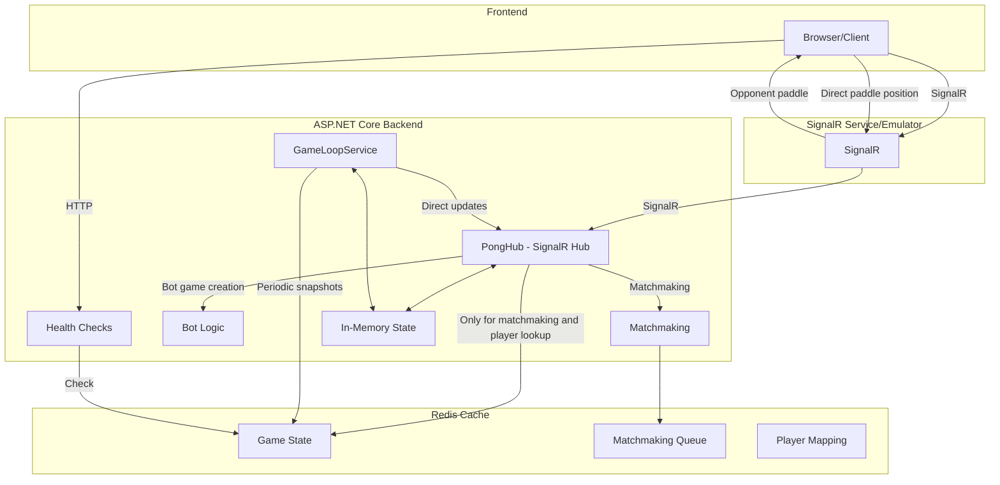
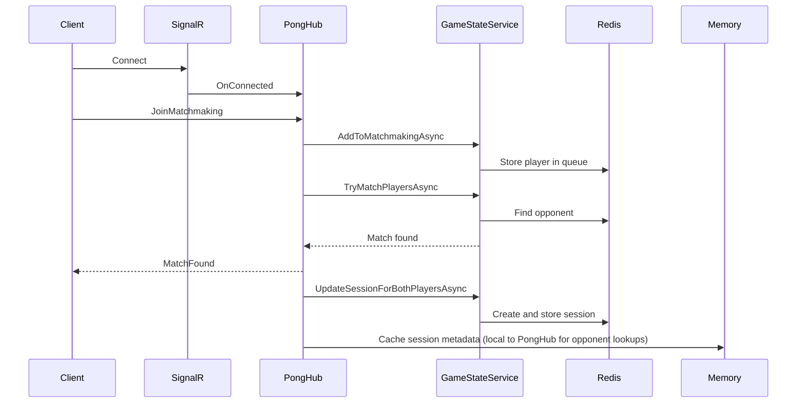
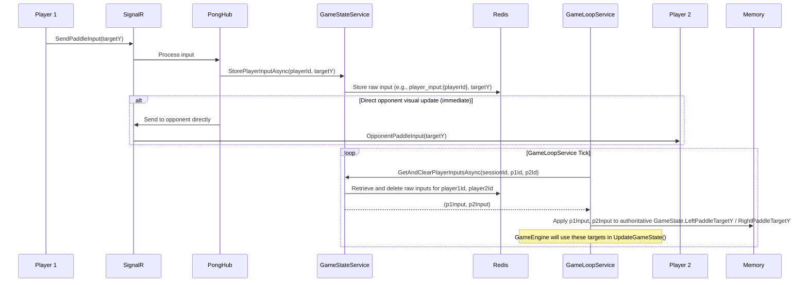
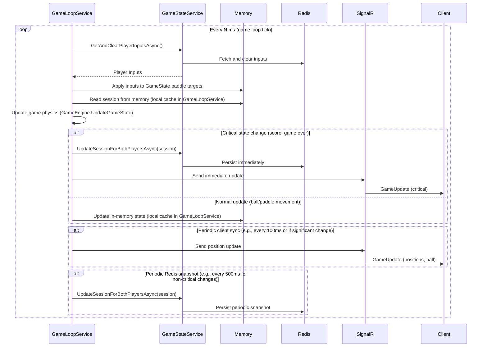

# Azure Online Pong Game - System Design

## Overview
This document describes the architecture, components, flows, and interactions of the Azure Online Pong Game system. The system leverages ASP.NET Core, Azure SignalR Service, Redis, and a static frontend to provide real-time multiplayer Pong gameplay.

---

## System Components

- **Frontend (Static Web App):**
  - HTML/CSS/JS client for gameplay, matchmaking, and UI.
  - Connects to backend via SignalR for real-time updates.

- **ASP.NET Core Backend:**
  - Implements SignalR Hub, matchmaking, game loop, and bot logic.
  - Provides HTTP endpoints for health checks.
  - Maintains in-memory state for active games with periodic Redis persistence.

- **Azure SignalR Service (or Emulator):**
  - Provides real-time messaging between clients and backend.
  - Supports horizontal scaling with sticky sessions.

- **Redis Cache:**
  - Stores player-to-session mappings and critical state.
  - Used for matchmaking queue and session recovery.
  - Functions as durable storage for critical events.

---

## High-Level Architecture

---

## Memory vs. Redis Usage Strategy

The system uses a hybrid storage approach to minimize Redis dependencies while maintaining scalability:

| Data Type | Storage Strategy | Update Frequency | 
|-----------|------------------|------------------|
| Matchmaking Queue | Redis | Real-time |
| Session Metadata | Redis + Memory | Initial lookup, then cached |
| Player-Session Mapping | Redis + Memory | Initial lookup, then cached |
| Paddle Inputs (Targets) | Redis (short-lived) -> Memory (processed by GameLoopService) | Player input frequency (Redis) -> Game loop tick (Memory) |
| Ball Physics | Memory (In-process, authoritative in GameLoopService) | Game loop tick. Snapshots to Redis periodically. |
| Game Scores | Memory + Redis | Critical updates persist immediately to Redis. |
| Game Over State | Memory + Redis | Critical updates persist immediately to Redis. |

This hybrid approach provides:
- Faster real-time gameplay through in-memory processing by `GameLoopService`.
- Reduced Redis write operations for continuous paddle positions (inputs are small and transient in Redis).
- Reliable state recovery in case of server failures.
- Instant paddle updates via direct SignalR communication.
- Support for horizontal scaling with proper sticky sessions.

---

## Component Details

### Frontend
- Renders the Pong game and UI.
- Handles user input and sends paddle updates via SignalR.
- Receives game state updates and renders them.
- Initiates matchmaking and bot matches.

### ASP.NET Core Backend
- **PongHub:**
  - Handles SignalR messages (matchmaking, keep-alive, etc.).
  - Receives raw paddle input from clients and forwards it to `GameStateService` for temporary storage in Redis.
  - Maintains in-memory mapping of players to sessions for direct opponent visual updates.
  - Implements direct client-to-client paddle position updates for visual responsiveness.
- **GameStateService:**
  - Manages game state persistence and retrieval in Redis.
  - Handles player matchmaking queue.
  - Stores raw player inputs (paddle targets) temporarily in Redis for `GameLoopService` to consume.
  - Stores and retrieves game sessions.
- **GameLoopService:**
  - Runs as a BackgroundService.
  - Retrieves active game sessions and player inputs from Redis (via `GameStateService`).
  - Applies player inputs to the game state.
  - Uses `GameEngine` to update game physics based on the latest state (including processed inputs).
  - Updates Redis for critical state changes (scores, game over) or periodic snapshots of the full game state.
  - Directly pushes game updates (authoritative state) to clients via SignalR.
- **GameEngine:**
  - Contains the core game logic.
  - Handles ball movement, collisions, and scoring.
- **Health Check Endpoints:**
  - Exposes basic system health information.

### Azure SignalR Service
- Relays real-time messages between clients and backend.
- Supports multiple backend instances with proper routing.

### Redis Cache
- Primary function is matchmaking and recovery.
- Used for initial player-to-session lookups.
- Stores periodic snapshots of game state.
- Immediately persists critical state changes.

---

## Main Flows

### 1. Multiplayer Matchmaking Flow

### 2. Paddle Input and Processing Flow

### 3. Game State Update Flow

---

## Horizontal Scaling Considerations

The system is designed to support horizontal scaling with these considerations:

1. **Sticky Sessions Requirement**:
   - SignalR clients need sticky sessions to maintain connection to the same backend
   - Load balancer should support affinity based on connection ID

2. **Redis as Coordination Layer**:
   - Matchmaking still relies on Redis for cross-instance player matching
   - Session metadata is in Redis for initial connections and recovery

3. **Memory Usage Optimization**:
   - Each server instance only loads the game sessions it's actively handling
   - Memory footprint scales linearly with active connections per instance

4. **Failover Handling**:
   - Periodic state snapshots to Redis enable recovery after instance failure
   - Critical game events (scoring, game completion) are immediately persisted

5. **Scaling Guidance**:
   - Configure Azure SignalR Service with multiple units as needed
   - Scale backend instances based on active connection count
   - Redis should be sized based on total concurrent game count, not traffic volume

---

## Error Handling & Resilience
- SignalR connection loss is detected and surfaced to the user via UI notifications.
- Periodic game state snapshots in Redis allow for recovery from transient failures.
- Automatic reconnection is enabled for SignalR clients.
- Connection state tracking helps manage player disconnect/reconnect scenarios.

---

## Security Considerations
- All sensitive operations are performed server-side.
- Redis is not exposed publicly.
- CORS policies limit which origins can connect to the backend.

---

## Summary
This system design enables real-time, scalable, and resilient Pong gameplay using ASP.NET Core, SignalR, and Redis, with optimizations to reduce Redis dependencies for better performance and cost-efficiency.
