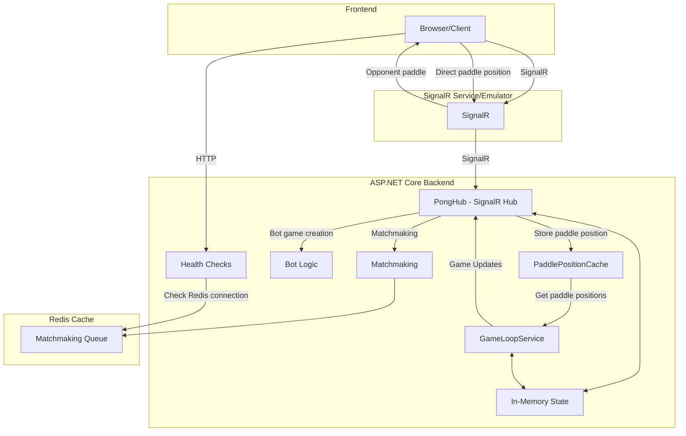
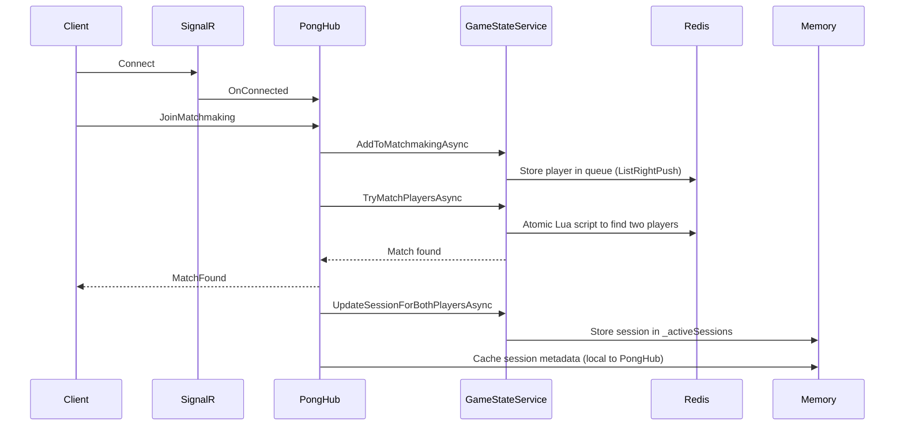
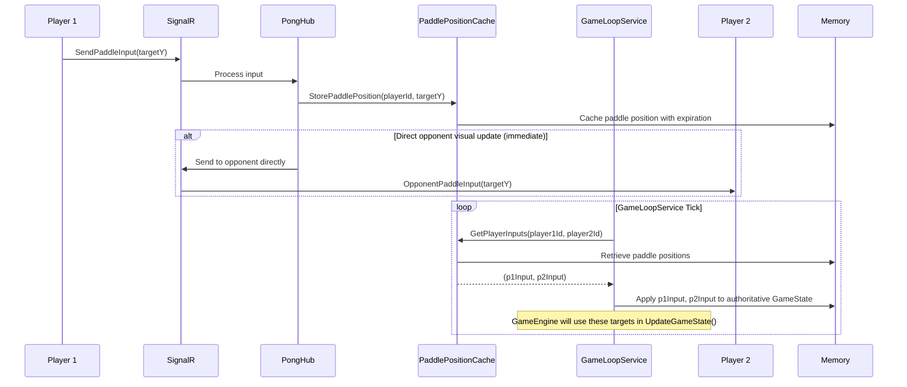
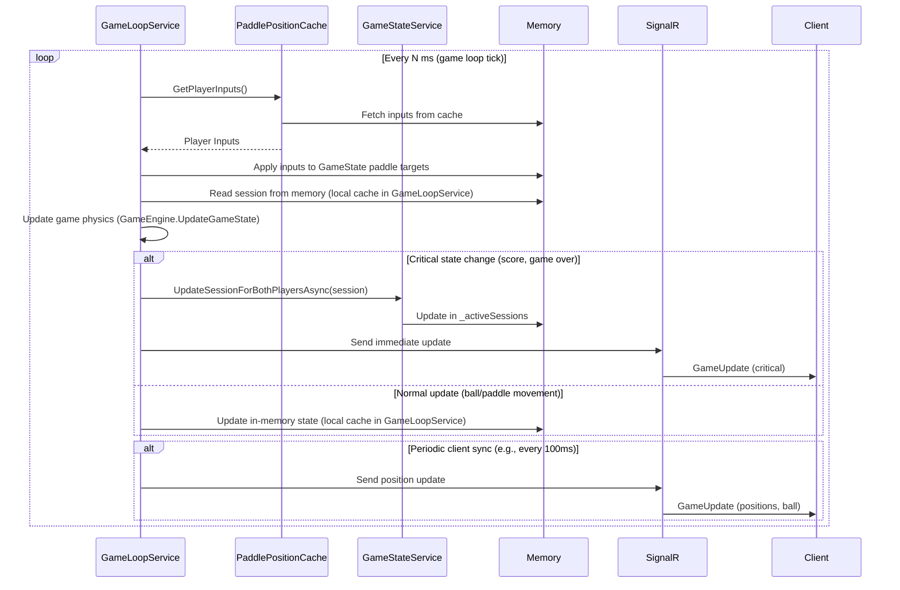

# Azure Online Pong Game - System Design

## Overview
This document describes the architecture, components, flows, and interactions of the Azure Online Pong Game system. The system leverages ASP.NET Core, Azure SignalR Service, Redis, and a static frontend to provide real-time multiplayer Pong gameplay, with optimizations to minimize Redis dependencies.

---

## System Components

- **Frontend (Static Web App):**
  - HTML/CSS/JS client for gameplay, matchmaking, and UI.
  - Connects to backend via SignalR for real-time updates.
  - Provides debugging tools for gameplay visualization and troubleshooting.

- **ASP.NET Core Backend:**
  - Implements SignalR Hub, matchmaking, game loop, and bot logic.
  - Provides HTTP endpoints for health checks.
  - Maintains in-memory state for active games with minimal Redis dependency.

- **Azure SignalR Service (or Emulator):**
  - Provides real-time messaging between clients and backend.
  - Supports horizontal scaling with sticky sessions.

- **Redis Cache:**
  - Primary use is for the matchmaking queue to ensure atomic player matching.
  - Provides health metrics and system monitoring.
  - Serves as a coordination layer for horizontally scaled deployments.

---

## High-Level Architecture

---

## Memory vs. Redis Usage Strategy

The system uses a hybrid storage approach with a strong emphasis on in-memory caching to minimize Redis dependencies:

| Data Type | Storage Strategy | Update Frequency | 
|-----------|------------------|------------------|
| Matchmaking Queue | Redis | Real-time |
| Game Sessions | In-Memory (_activeSessions) | Real-time, with in-memory storage only |
| Player-Session Mapping | In-Memory (PongHub) | Tracked per connection |
| Paddle Positions | In-Memory (PaddlePositionCache) | Real-time |
| Ball Physics | In-Memory (GameLoopService) | Game loop tick |
| Game Scores | In-Memory | Game loop tick |
| Game Over State | In-Memory | Game loop tick |

This optimized approach provides:
- Faster real-time gameplay through in-memory processing by `GameLoopService` and `PaddlePositionCache`.
- Atomic matchmaking operations via Redis for reliability when scaling horizontally.
- Instant paddle updates via direct SignalR communication.
- Support for horizontal scaling with proper sticky sessions.
- Reduced Redis dependencies for improved performance and cost efficiency.

---

## Component Details

### Frontend
- Renders the Pong game and UI.
- Handles user input and sends paddle updates via SignalR.
- Receives game state updates and renders them.
- Initiates matchmaking and bot matches.
- Provides debug visualization tools for development and troubleshooting.

### ASP.NET Core Backend
- **PongHub:**
  - Handles SignalR messages (matchmaking, keep-alive, etc.).
  - Receives paddle input from clients and forwards it to `PaddlePositionCache`.
  - Maintains in-memory mapping of players to sessions for direct opponent visual updates.
  - Implements direct client-to-client paddle position updates for visual responsiveness.
- **GameStateService:**
  - Manages matchmaking queue through Redis.
  - Stores game sessions in memory using a `ConcurrentDictionary`.
  - Provides health check information about Redis connectivity.
  - Retrieves matchmaking queue size for metrics.
- **PaddlePositionCache:**
  - New component that stores paddle positions in-memory using `IMemoryCache`.
  - Provides quick access to player inputs without Redis dependencies.
  - Handles automatic expiration of stale paddle positions.
- **GameLoopService:**
  - Runs as a BackgroundService.
  - Retrieves active game sessions from memory.
  - Gets player inputs from PaddlePositionCache.
  - Applies player inputs to the game state.
  - Uses `GameEngine` to update game physics based on the latest state.
  - Directly pushes game updates (authoritative state) to clients via SignalR.
- **GameEngine:**
  - Contains the core game logic.
  - Handles ball movement, collisions, and scoring.
- **Health Check Endpoints:**
  - Exposes basic system health information including Redis connectivity and matchmaking metrics.

### Azure SignalR Service
- Relays real-time messages between clients and backend.
- Supports multiple backend instances with proper routing.

### Redis Cache
- Primary function is now limited to matchmaking coordination.
- Used for atomic player-to-player matching when running multiple instances.
- Provides health metrics to validate system connectivity.

---

## Main Flows

### 1. Multiplayer Matchmaking Flow

### 2. Paddle Input and Processing Flow

### 3. Game State Update Flow

---

## Horizontal Scaling Considerations

The system is designed to support horizontal scaling with these considerations:

1. **Sticky Sessions Requirement**:
   - SignalR clients need sticky sessions to maintain connection to the same backend
   - Load balancer should support affinity based on connection ID

2. **Redis as Coordination Layer**:
   - Matchmaking still relies on Redis for cross-instance player matching with atomic operations
   - Redis is used for health checks and metrics across instances

3. **Memory Usage Optimization**:
   - Each server instance only loads the game sessions it's actively handling
   - Memory footprint scales linearly with active connections per instance
   - No Redis persistence means less overhead for game state management

4. **Failover Handling**:
   - Game sessions exist only in memory of the hosting instance
   - If an instance fails, clients reconnect to a new instance and start new games
   - Optimization for performance rather than state durability

5. **Scaling Guidance**:
   - Configure Azure SignalR Service with multiple units as needed
   - Scale backend instances based on active connection count
   - Redis can be minimally sized as it's only used for matchmaking coordination

---

## Error Handling & Resilience
- SignalR connection loss is detected and surfaced to the user via UI notifications.
- Automatic reconnection is enabled for SignalR clients with configurable retry policies.
- Connection state tracking helps manage player disconnect/reconnect scenarios.
- Game state is fully in-memory for optimal performance.

---

## Security Considerations
- All sensitive operations are performed server-side.
- Redis is not exposed publicly and is minimally used.
- CORS policies limit which origins can connect to the backend.
- Authentication system is prepared for integration with Azure Static Web Apps Auth.

---

## Summary
This system design enables real-time, scalable, and high-performance Pong gameplay using ASP.NET Core, SignalR, and minimal Redis dependencies, optimized for better performance and cost-efficiency. The architecture has evolved to prefer in-memory state management with Redis primarily used for matchmaking coordination.
