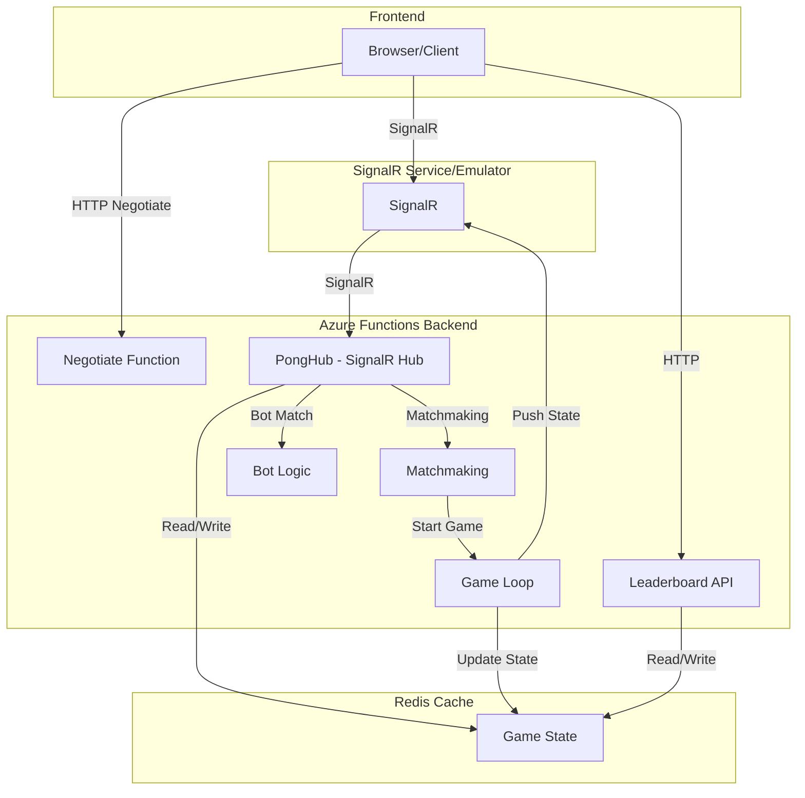
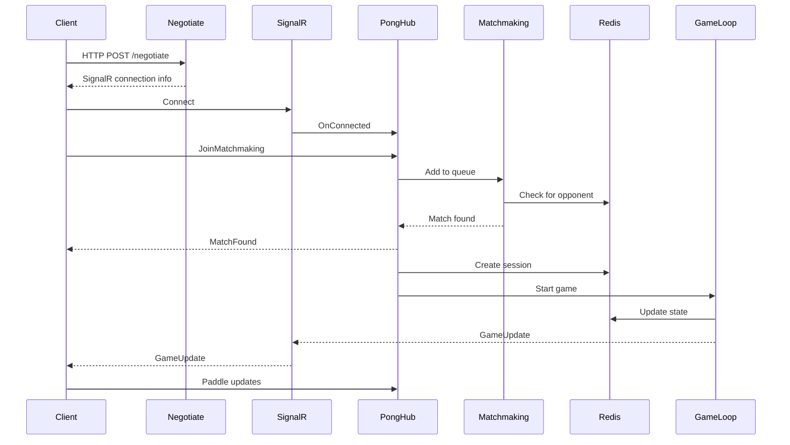
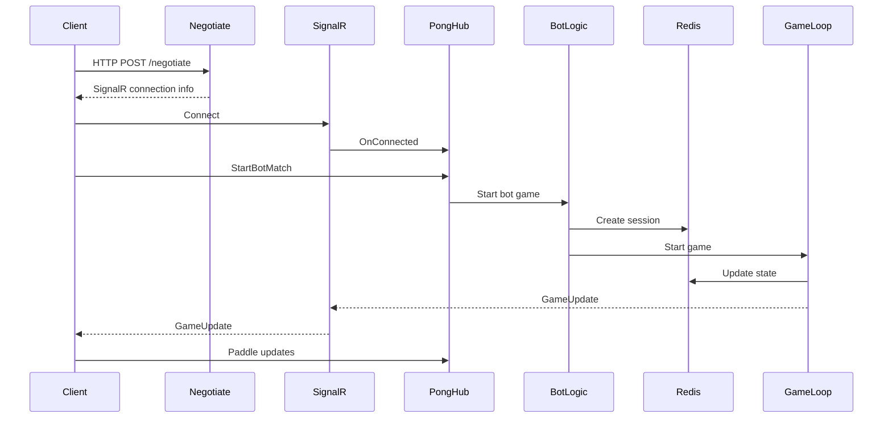
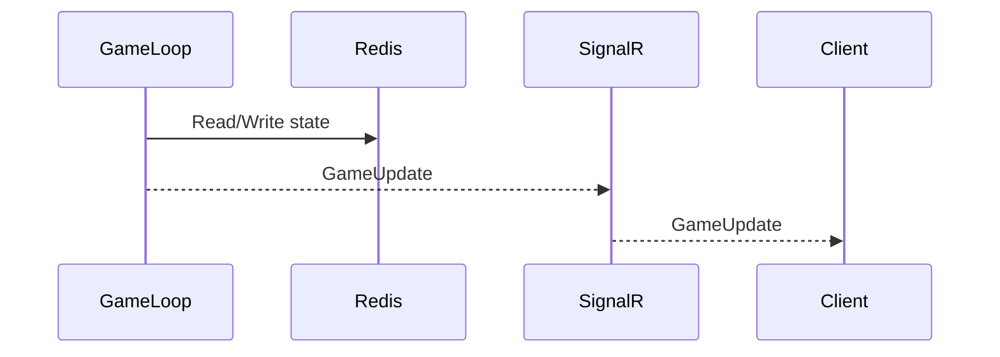
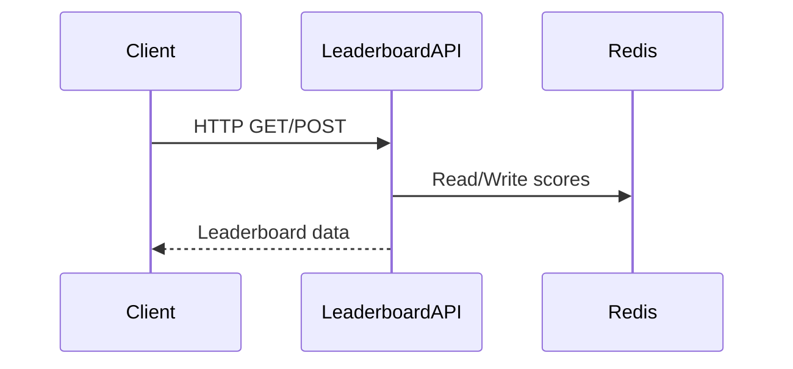

# Azure Online Pong Game - System Design

## Overview
This document describes the architecture, components, flows, and interactions of the Azure Online Pong Game system. The system leverages Azure Functions, Azure SignalR Service, Redis, and a static frontend to provide real-time multiplayer Pong gameplay.

---

## System Components

- **Frontend (Static Web App):**
  - HTML/CSS/JS client for gameplay, matchmaking, and UI.
  - Connects to backend via SignalR for real-time updates.

- **Azure Functions Backend:**
  - Implements SignalR negotiation, matchmaking, game loop, and bot logic.
  - Exposes HTTP endpoints for negotiation and leaderboard.

- **Azure SignalR Service (or Emulator):**
  - Provides real-time messaging between clients and backend.

- **Redis Cache:**
  - Stores game sessions and state for fast access and persistence.

- **(Optional) Leaderboard Service:**
  - Stores and retrieves player scores and rankings.

---

## High-Level Architecture

---

## Component Details

### Frontend
- Renders the Pong game and UI.
- Handles user input and sends paddle updates via SignalR.
- Receives game state updates and renders them.
- Initiates matchmaking and bot matches.

### Azure Functions Backend
- **Negotiate Function:**
  - Issues SignalR connection info and access tokens.
- **PongHub:**
  - Handles SignalR messages (paddle updates, matchmaking, etc.).
  - Manages player connections and disconnections.
- **Matchmaking:**
  - Pairs players for multiplayer games.
- **Game Loop:**
  - Runs the game simulation, updates state, and broadcasts to players.
- **Bot Logic:**
  - Simulates AI opponent for solo matches.
- **Leaderboard API:**
  - Handles score submissions and leaderboard queries.

### Azure SignalR Service
- Relays real-time messages between clients and backend.

### Redis Cache
- Stores active game sessions and state for fast access.
- Used for matchmaking queues and leaderboard data.

---

## Main Flows

### 1. Multiplayer Matchmaking Flow
This flow describes how a player connects, joins the matchmaking queue, gets paired with an opponent, and starts a multiplayer game. The state is managed in Redis, and updates are sent via SignalR.

### 2. Bot Match Flow
This flow outlines how a player starts a game against an AI opponent. The backend creates a session and uses the bot logic to control the opponent's paddle.

### 3. Game State Update Flow
This flow shows the core game loop interaction. The backend game loop runs approximately every 33 milliseconds (~30 FPS), reads and writes the game state to Redis, and broadcasts the updated state to connected clients via SignalR.

### 4. Leaderboard Flow
This flow describes how clients interact with the leaderboard API (an Azure Function) to submit scores or retrieve the current rankings, which are stored in Redis.

---

## Error Handling & Resilience
- SignalR connection loss is detected and surfaced to the user via UI toasts.
- Game state is persisted in Redis to allow recovery from transient failures.
- Automatic reconnection is enabled for SignalR clients.

---

## Security Considerations
- SignalR access tokens are issued per connection.
- All sensitive operations are performed server-side.
- Redis is not exposed publicly.

---

## Extensibility
- Add chat, spectator mode, or rematch flows by extending SignalR and backend logic.
- Swap Redis for another persistent store if needed.
- Deploy to Azure Static Web Apps, Azure Functions, and Azure SignalR for production.

---

## Summary
This system design enables real-time, scalable, and resilient Pong gameplay using Azure serverless technologies and best practices.
